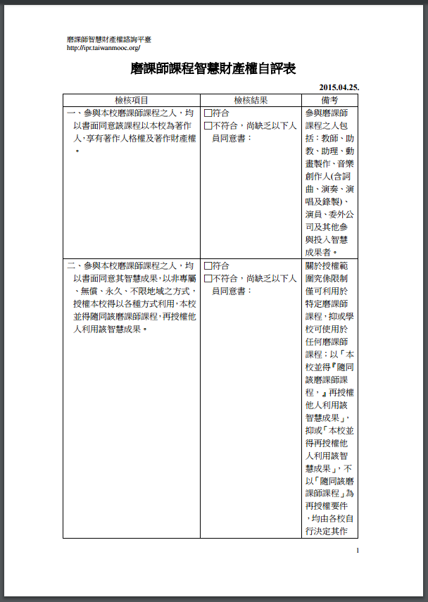

# 二、智財檢核機制

<h4>1、為何需要智慧財產權專家?

&nbsp;&nbsp;&nbsp;&nbsp;磨課師課程之製作，涉及很多著作，法律關係上，整個課程是一個獨立著作，其中使用了教師的上課演講、自製的教材、出版社之書籍或他人之影音、圖片等等。如果再加上學生互動過程中的意見、作業或提供的他人資訊，就更為複雜。因此需要專家提供教材製作時智慧財產權疑慮之釋疑及取得合法版權之程序建議。 

<h4>2、磨課師課程製作最須釐清的問題有那些？

&nbsp;&nbsp;&nbsp;&nbsp;為了方便磨課師課程後續利用，必須先釐清以下著作權議題： 

&nbsp;&nbsp;&nbsp;&nbsp;(1)磨課師課程權利歸屬：因為磨課師課程是由學校整合教師、製作技術、學生等各方人員所完成的綜合成果，所以要確認誰是整個磨課師課程的著作人及著作財產權人。 

&nbsp;&nbsp;&nbsp;&nbsp;(2)磨課師課程之授權利用或合理使用：整個磨課師課程中使用到很多人的著作，有些是透過授權，有些是屬於合理使用而無須取得授權。在授權方面，又可區分為(一)一般授權；(二)創用CC及(三)法定授權，各有不同狀態與條件。在合理使用方面，必須其利用合於著作權法合理使用規定，才能免除授權責任。 

<h4>3、智慧財產權審核機制包含那些要點？

&nbsp;&nbsp;&nbsp;&nbsp;數位學習教材製作與管理辦法、智慧財產權審查流程、課程外來素材清單表、著作權聲明書及歸屬書、授權同意書、智財疑義諮詢服務等。 

<h4>4、磨課師課程智慧財產權應歸屬教師還是學校?

&nbsp;&nbsp;&nbsp;&nbsp;磨課師課程是整個製作團隊群策群力的成果，不是任何個人可以獨立完成，其內容包括教師的講述、自製教材、技術團隊後製影音、動畫、出版社或他人之書籍、影音、圖片，甚至學生互動過程中提出之意見、作業或引用之他人著作。 

&nbsp;&nbsp;&nbsp;&nbsp;依據著作權法第 10 條規定，著作自完成時起，就自動受到著作權法保護，不必申請註冊、登記或進行著作權標示。法律關係上，整個磨課師課程是一個獨立著作，其中使用了前述各方面人員的著作。如果沒有特別約定，原則上，是學校獲得參與課程的各方面人員同意後，將他們的著作使用在整個磨課師課程中。 

&nbsp;&nbsp;&nbsp;&nbsp;因此，學校是磨課師課程的著作人及著作財產權人，對於該課程得自行及再授權他人利用。至於參與的各方面人員，對於自己完成的著作部分，固然可能有著作權，但對於整個磨課師課程，並不能主張權利。 

&nbsp;&nbsp;&nbsp;&nbsp;為使參與磨課師課程的各方方面人員清楚了解前述情形，方便磨課師課程的整體利用，建議學校於推動磨課師課程前，先讓大家簽署「著作利用同意書」，避免日後爭議。 

<h4>5、應如何確認磨課師課程已符合智慧財產權規定？

&nbsp;&nbsp;&nbsp;&nbsp;可參考<a href="http://ipr.taiwanmooc.org/" target="_blank" title="磨課師智慧財產權諮詢平臺">
磨課師智慧財產權諮詢平臺</a>制定的<a href="http://goo.gl/mZsKwp" target="_blank" title="磨課師課程智慧財產權自評表">
磨課師課程智慧財產權自評表。</a> 

<h4>

&nbsp;&nbsp;&nbsp;&nbsp; 

&nbsp;&nbsp;&nbsp;&nbsp; 

&nbsp;&nbsp;&nbsp;&nbsp; 

&nbsp;&nbsp;&nbsp;&nbsp; 

<h4>

&nbsp;&nbsp;&nbsp;&nbsp; 

&nbsp;&nbsp;&nbsp;&nbsp; 

&nbsp;&nbsp;&nbsp;&nbsp; 

&nbsp;&nbsp;&nbsp;&nbsp; 

<h4>

&nbsp;&nbsp;&nbsp;&nbsp; 

&nbsp;&nbsp;&nbsp;&nbsp; 

<h4>

&nbsp;&nbsp;&nbsp;&nbsp; 

&nbsp;&nbsp;&nbsp;&nbsp; 

<h4>

&nbsp;&nbsp;&nbsp;&nbsp; 

&nbsp;&nbsp;&nbsp;&nbsp; 

&nbsp;&nbsp;&nbsp;&nbsp; 

&nbsp;&nbsp;&nbsp;&nbsp; 

<h4>

&nbsp;&nbsp;&nbsp;&nbsp; 

&nbsp;&nbsp;&nbsp;&nbsp; 

<h4>

&nbsp;&nbsp;&nbsp;&nbsp; 

<h4>

&nbsp;&nbsp;&nbsp;&nbsp; 

&nbsp;&nbsp;&nbsp;&nbsp; 

<h4>

&nbsp;&nbsp;&nbsp;&nbsp; 

<h4>

&nbsp;&nbsp;&nbsp;&nbsp; 

<h4>

&nbsp;&nbsp;&nbsp;&nbsp; 

<h4>

&nbsp;&nbsp;&nbsp;&nbsp; 

<h4>

&nbsp;&nbsp;&nbsp;&nbsp; 
