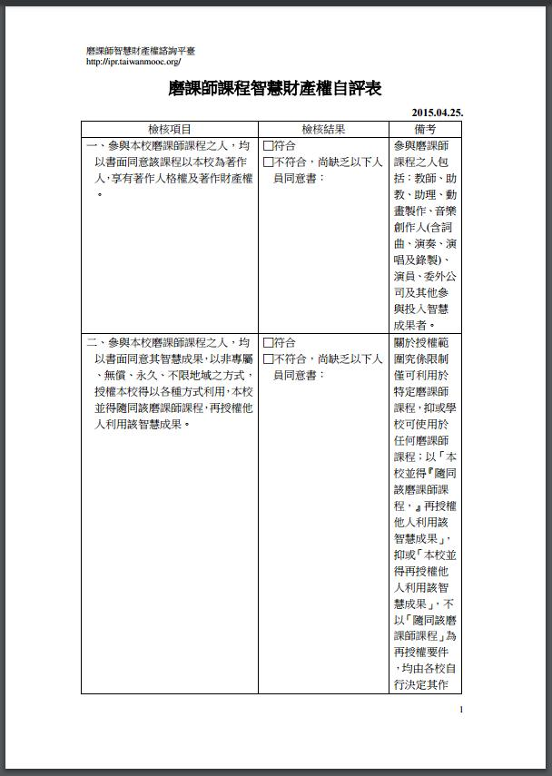
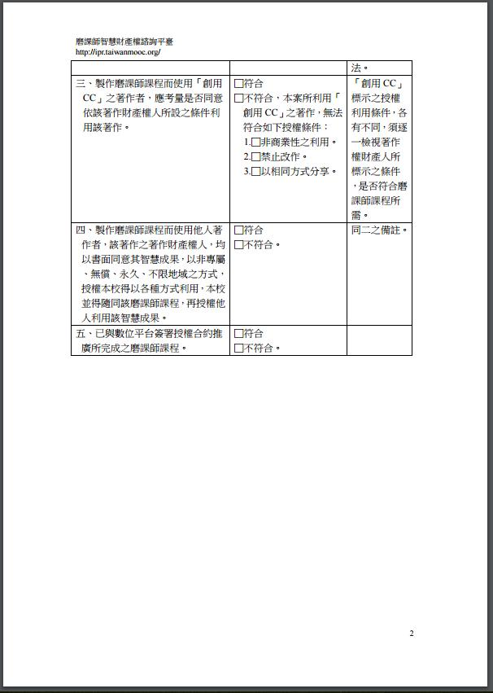

# 二、智財檢核機制

<h4>1、為何需要智慧財產權專家?

&nbsp;&nbsp;&nbsp;&nbsp;磨課師課程之製作，涉及很多著作，法律關係上，整個課程是一個獨立著作，其中使用了教師的上課演講、自製的教材、出版社之書籍或他人之影音、圖片等等。如果再加上學生互動過程中的意見、作業或提供的他人資訊，就更為複雜。因此需要專家提供教材製作時智慧財產權疑慮之釋疑及取得合法版權之程序建議。 

<h4>2、磨課師課程製作最須釐清的問題有那些？

&nbsp;&nbsp;&nbsp;&nbsp;為了方便磨課師課程後續利用，必須先釐清以下著作權議題： 

&nbsp;&nbsp;&nbsp;&nbsp;(1)磨課師課程權利歸屬：因為磨課師課程是由學校整合教師、製作技術、學生等各方人員所完成的綜合成果，所以要確認誰是整個磨課師課程的著作人及著作財產權人。 

&nbsp;&nbsp;&nbsp;&nbsp;(2)磨課師課程之授權利用或合理使用：整個磨課師課程中使用到很多人的著作，有些是透過授權，有些是屬於合理使用而無須取得授權。在授權方面，又可區分為(一)一般授權；(二)創用CC及(三)法定授權，各有不同狀態與條件。在合理使用方面，必須其利用合於著作權法合理使用規定，才能免除授權責任。 

<h4>3、智慧財產權審核機制包含那些要點？

&nbsp;&nbsp;&nbsp;&nbsp;數位學習教材製作與管理辦法、智慧財產權審查流程、課程外來素材清單表、著作權聲明書及歸屬書、授權同意書、智財疑義諮詢服務等。 

<h4>4、磨課師課程智慧財產權應歸屬教師還是學校?

&nbsp;&nbsp;&nbsp;&nbsp;磨課師課程是整個製作團隊群策群力的成果，不是任何個人可以獨立完成，其內容包括教師的講述、自製教材、技術團隊後製影音、動畫、出版社或他人之書籍、影音、圖片，甚至學生互動過程中提出之意見、作業或引用之他人著作。 

&nbsp;&nbsp;&nbsp;&nbsp;依據著作權法第 10 條規定，著作自完成時起，就自動受到著作權法保護，不必申請註冊、登記或進行著作權標示。法律關係上，整個磨課師課程是一個獨立著作，其中使用了前述各方面人員的著作。如果沒有特別約定，原則上，是學校獲得參與課程的各方面人員同意後，將他們的著作使用在整個磨課師課程中。 

&nbsp;&nbsp;&nbsp;&nbsp;因此，學校是磨課師課程的著作人及著作財產權人，對於該課程得自行及再授權他人利用。至於參與的各方面人員，對於自己完成的著作部分，固然可能有著作權，但對於整個磨課師課程，並不能主張權利。 

&nbsp;&nbsp;&nbsp;&nbsp;為使參與磨課師課程的各方方面人員清楚了解前述情形，方便磨課師課程的整體利用，建議學校於推動磨課師課程前，先讓大家簽署「著作利用同意書」，避免日後爭議。 

<h4>5、應如何確認磨課師課程已符合智慧財產權規定？

&nbsp;&nbsp;&nbsp;&nbsp;可參考<a href="http://ipr.taiwanmooc.org/" target="_blank" title="磨課師智慧財產權諮詢平臺">
磨課師智慧財產權諮詢平臺</a>制定的<a href="http://goo.gl/mZsKwp" target="_blank" title="磨課師課程智慧財產權自評表">
磨課師課程智慧財產權自評表。</a> 

<h4>6、學校與講者在磨課師課程發展上有哪些智慧財產權注意事項？

&nbsp;&nbsp;&nbsp;&nbsp;(1)講者同意學校係磨課師課程之著作人，享有著作人格權及著作財產權。  

&nbsp;&nbsp;&nbsp;&nbsp;(2)講者理解磨課師課程係全球線上公開傳輸之課程，同意學校得於磨課師課程中利用其著作，並得隨同該磨課師課程再授權他人利用。  

&nbsp;&nbsp;&nbsp;&nbsp;(3)講者保證其所提供之內容，未侵害他人之智慧財產權或其他權利。  

&nbsp;&nbsp;&nbsp;&nbsp;(4)學校同意於磨課師課程標示講者之姓名。 

<h4>7、學校與幕後工作人員在磨課師課程發展上有哪些智慧財產權注意事項？

&nbsp;&nbsp;&nbsp;&nbsp;(1)幕後工作人員同意學校係磨課師課程之著作人，享有著作人格權及著作財產權。  

&nbsp;&nbsp;&nbsp;&nbsp;(2)幕後工作人員理解磨課師課程係全球線上公開傳輸之課程，同意學校得於磨課師課程中利用其著作，並得隨同該磨課師課程再授權他人利用。  

&nbsp;&nbsp;&nbsp;&nbsp;(3)幕後工作人員保證其所提供之內容，未侵害他人之智慧財產權或其他權利。  

&nbsp;&nbsp;&nbsp;&nbsp;(4)學校同意於磨課師課程標示幕後工作人員之姓名或名稱 

<h4>8、學校與學習者在磨課師課程發展上有哪些智慧財產權注意事項？

&nbsp;&nbsp;&nbsp;&nbsp;(1)學習者理解磨課師課程係全球線上公開傳輸之課程，同意學校於磨 課師課程中利用其參與課程所提出之作業、參與討論內容及測驗結 果等，並得隨同該磨課師課程再授權他人利用。  

&nbsp;&nbsp;&nbsp;&nbsp;(2)學習者被授權的使用範圍，例如學習者不能重製課程內容，課程內 容及相關資源限定在課程相關之個人使用。 

<h4>9、學校與其他內容之著作財產權人在磨課師課程發展上有哪些智慧財產權注意事項？

&nbsp;&nbsp;&nbsp;&nbsp;(1)其他內容之著作財產權人(例如，出版社、圖庫公司、軟體公司或 影音產品發行公司)保證其係該內容之著作財產權人或有權授權之 人，其理解磨課師課程係全球線上公開傳輸之課程，同意學校得於 磨課師課程中利用其著作，並得隨同該磨課師課程再授權他人利用。  

&nbsp;&nbsp;&nbsp;&nbsp;(2)學校同意於磨課師課程標示內容著作人之姓名或名稱。 

<h4>10、學校與平臺在磨課師課程發展上有哪些智慧財產權注意事項？

&nbsp;&nbsp;&nbsp;&nbsp;(1)學校得授權平臺利用學校所完成之磨課師課程，其授權方式包括專屬或非專屬授權，線上公開傳輸範圍是否僅限特定國家、地區或全球，利用時間係一定期間或永久，有無權利金，是否得進一步重製、散布、公開播送、公開演出、公開上映、改作等。  

&nbsp;&nbsp;&nbsp;&nbsp;(2)衍生著作如翻譯之智慧財產權歸屬。  

&nbsp;&nbsp;&nbsp;&nbsp;(3)學校因應課程所開發之文件、軟體，其權利屬於學校享有，而上述著作是否授權平臺使用及其授權範圍。  

&nbsp;&nbsp;&nbsp;&nbsp;(4)平臺可否再授權他人利用？得否營利？是否與學校分配權利金？如何結算？   

<h4>11、未經新聞網站同意而註明出處後轉用其新聞內容於非商業用途，是否會構成侵害著作權？

&nbsp;&nbsp;&nbsp;&nbsp;雖然著作權法第九條第一項第四款規定，「單純為傳達事實之新聞報導所作成之語文著作」，「不得為著作權之標的」，亦即不受著作權法之保護，任何人均得自由利用，此係基於資訊傳播之考量，使新聞報導得被廣泛利用。不過其僅限於「單純為傳達事實之新聞報導所作成之語文著作」，即新聞學上所稱「五個W一個H」等敘述，即單純的報導何人(who)於何時(when)在何地(where)因何原因(why)如何(how)發生何事(what)等，不包括專論報導、評論等，也不包括照片、圖片或影片。因此，並不是所有的新聞報導都不受著作權法保護，而事實上，目前的新聞報導多半事實報導與觀察評析夾雜，「單純為傳達事實之新聞報導所作成之語文著作」已至為少見，故其新聞報導應該都可以受著作權法保護。 

&nbsp;&nbsp;&nbsp;&nbsp;又著作權法第六十一條規定：「揭載於新聞紙、雜誌或網路上有關政治、經濟或社會上時事問題之論述，得由其他新聞紙、雜誌轉載或由廣播或電視公開播送，或於網路上公開傳輸。但經註明不許轉載、公開播送或公開傳輸者，不在此限。」目前許多新聞網站都會載明「本刊內容不得轉載、公開播送或公開傳輸」之文字，將會產生他人不得自由轉載、公開播送或公開傳輸之情形。因此，新聞網站之新聞內容，縱使係使用於非商業用途，仍應取得授權使得利用，如無法取得授權，或認為授權成本過高，建議得以鏈結方式，將使用者送往該網頁瀏覽。 

<h4>12、規劃將周杰倫的曲子自行改編曲後，於課程內演奏，是否要經過唱片公司授權？

&nbsp;&nbsp;&nbsp;&nbsp;因現今流行音樂仍有商業行為，建議先與唱片公司取得授權後改編。 

<h4>13、若音樂著作權擁有者無法取得聯繫或過世時，授權如何處理為佳？

&nbsp;&nbsp;&nbsp;&nbsp;要使用他人著作，原則上要取得同意或授權，除非可以找到合理使用的依據，才能免除授權的需求，例如，著作權法第五十二條規定：「為報導、評論、教學、研究或其他正當目的之必要，在合理範圍內，得引用已公開發表之著作。」這項規定所引用的著作，必須「在合理範圍內」，且應依第六十四條規定註明出處。 

&nbsp;&nbsp;&nbsp;&nbsp;如果音樂有CD或唱片發行，也許可以洽詢發行的唱片公司，如果真的連唱片公司都找不到人，這種「孤兒著作」可以依據著作權主管機關經濟部發布的「著作財產權人不明著作利用之許可授權及使用報酬辦法」申請利用，但因為手續複雜，需要相關費用，並不划算。除非是一定要使用特定的著作，如果可能，建議使用其他標示創用CC的著作，或是自行創作，或是與學校其他創作課程合作，由學生參與創作，會更為減省。 

<h4>14、樂譜出版商目前簽約如為買斷方式，仍無法錄製為數位課程所用，是否有其他建議方式？

&nbsp;&nbsp;&nbsp;&nbsp;建議可自行編曲或與出版商洽商，討論適合應用於磨課師課程的授權方式。 

<h4>15、若課程會需要介紹醫療器具，但上有廠商商標出現，商標該如何處理？

&nbsp;&nbsp;&nbsp;&nbsp;可利用影片後製蓋掉商標，或與廠商洽談置入性行銷合作。 

<h4>16、若與醫院合作，是否可以拍攝醫院場景作為教材內容？

&nbsp;&nbsp;&nbsp;&nbsp;基本上是可以的，但還是須請醫院簽署授權書，關鍵還是以課程設計做為出發點，若能提供教材成品供院方確認會更加妥當。 

<h4>17、課程圖片智財部分遇到圖片授權取得不易，該如何解決？ 

&nbsp;&nbsp;&nbsp;&nbsp;建議使用創用cc或自己畫的圖，也可搜尋國外OER的電子教科書，看看是否可找到相關資訊及圖片，亦可至磨課師智慧財產權諮詢平臺(<a href="http://ipr.taiwanmooc.org/" target="_blank" title="磨課師智慧財產權諮詢平臺">http://ipr.taiwanmooc.org/</a>)詢問相關細節問題。 

<h4>18、學校圖書館有買資料庫，是否可以直接使用？

&nbsp;&nbsp;&nbsp;&nbsp;資料庫是授權給學校內部使用，但因為磨課師是對外公開的，因此會受到智財權限制。 
