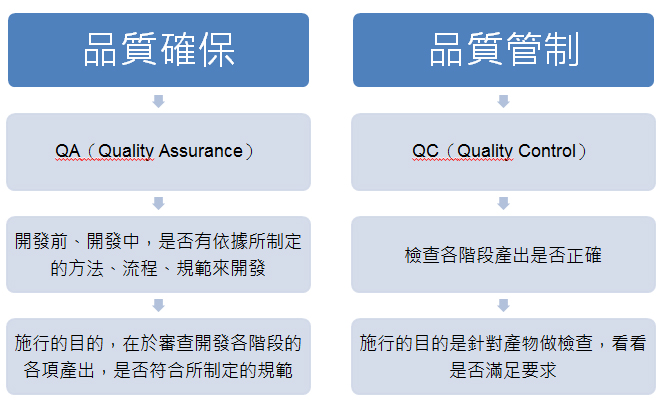
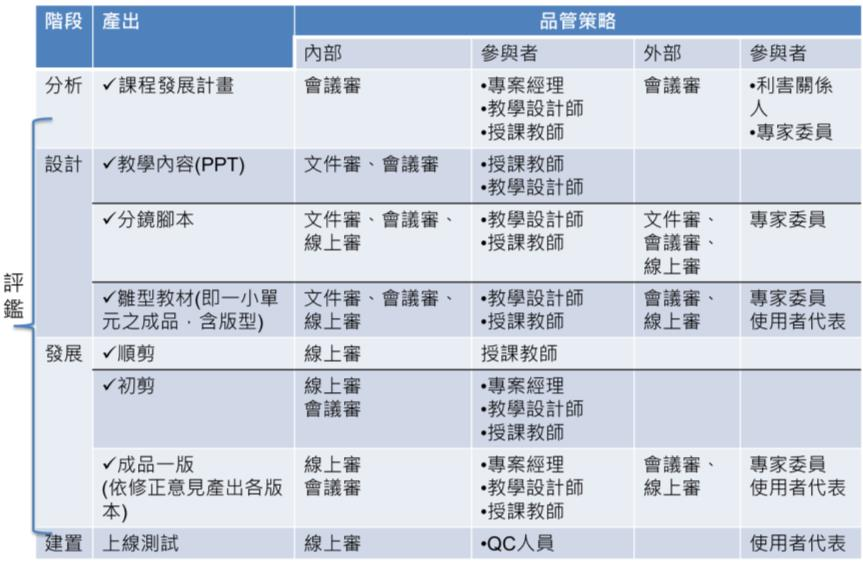

# 四、品質檢核機制

<h4>1、磨課師課程時數長，製作都來不及了，是不是一定要花時間品質檢核?

&nbsp;&nbsp;&nbsp;&nbsp;品質檢核機制可分為品質確保（QA,Quality Assurance）與品質管制（QC,Quality Control），QA 目標是在預防產品發生瑕疵，QC則在找出完成的成品中潛在的瑕疵，進行修正。 

&nbsp;&nbsp;&nbsp;&nbsp;在教材製作的專案管理中，品質檢核強調的是「預防勝於檢查」與「持續改善」，透過良好的事前規劃、設計、標準制定、製造，在每一個重要關卡，將品質植入於過程或產品設計中。 

&nbsp;&nbsp;&nbsp;&nbsp;雖然表面上看起來需要花費時間與人力，但是透過層層把關，可以有效減低錯誤，避免到了成品才大幅度修改，且可保持品質的一致性，反而是真正能省時省力的作法。 

<h4>2、如何做品質檢核?需要何種人力?檢核的時機點為何?

&nbsp;&nbsp;&nbsp;&nbsp;可針對單元教材影片之大綱、腳本、拍攝規格、拍攝注意事項、後製規格、測試流程等制定課程品質檢核規範，並發展相關表單，由具有課程設計及內容專業知識者進行檢核，成品亦可由目標學習者試閱，以利製作流程、時程與品質的掌控。 

&nbsp;&nbsp;&nbsp;&nbsp;以下為影片製作各階段品質檢核建議： 

