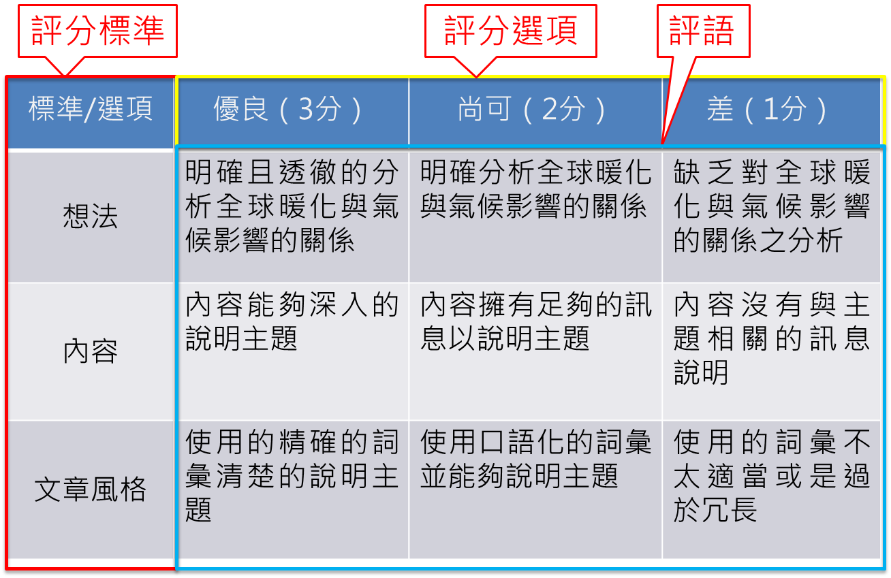

# 三、學習成效評量

<h4>1、測驗設計應該用哪個軟體比較好？

&nbsp;&nbsp;&nbsp;&nbsp;在評量或測驗設計上，無論使用哪一種軟體製作評量或測驗題目進行形成性評量，都需要能結合或整合至學習平台，讓教學者可以透過平台的統計分析結果，調整教學活動與教學策略，提高學習者的學習動機，並保持學習者的學習動力，直至課程結束為止，後續才能依據完成課程的學習者的學習歷程資料，進行學習成效的分析，以做為修正課程的參考。 

<h4>2、每個單元都要有測驗嗎?還是每周一個測驗？

&nbsp;&nbsp;&nbsp;&nbsp;透過課後即評式測驗可讓學習者快速了解自己是否理解學習內容，也可利用課前課中測驗引發學習興趣。評量活動需緊扣教學目標，每一至數個主題即可安排一回評量測驗，題目數量建議為五題內。單元完成後可進行單元總結性評量，出題時可跨越數個主題，考驗學習者綜合運用的能力。 

<h4>3、MOOCs常見評量型式有哪些?特點為何?開課時需要都使用嗎？

&nbsp;&nbsp;&nbsp;&nbsp;MOOCs常見評量型式有：問卷、議題討論、測驗、作業或專題成果。 

>
(1)問卷 

>>
通常用於學習前的學習者分析，亦可用於學習中與學習後。一份好的問卷調查表至少應該要問題具體、表述清楚、重點突出、整體結構好；確保問卷能完成調查任務與目的，且便於統計整理。 

>
(2)議題討論 

>>
依學習者程度設計可以讓其表達經驗或感受，且較能進行充分討論的議題，例如：我最想去的國家等等。討論期間須適時給予學習者回饋，並儘量引導學生能進一步再發揮自己的意見，例如可以應用提問、指定回應、交叉互動等策略，以便讓學習者可以充分運用已習得的內容 。 

>
(3) 測驗 

>>
MOOCs課程中使用測驗時機點為：影片閱讀中或該支影片後之單元測驗，以及課程最後之總測。測驗需緊扣教學目標，每一至數個單元影片即可安排一回測驗，題目數量建議為五題內。常用題型為：是非、單選、複選、簡答。 

>
(4)作業或專題成果  

>>
作業或專題成果可以看出學習者綜合應用的能力，可於期中或期末待學生累積一定學習內容後使用。由於MOOCs學習者數量龐大，教師與助教無法批閱這麼多作業，因此建議透過同儕互評的方式來進行。 

&nbsp;&nbsp;&nbsp;&nbsp;以上評量方法可依課程性質與學習目標，適時穿插於課程中以了解學生學習狀況，不見得需要全部使用。 

<h4>4、同儕互評是MOOCs課程常見的評量方式，設計時有哪些注意重點呢？

&nbsp;&nbsp;&nbsp;&nbsp;進行觀摩一般同儕互評活動中，學生需要透過四個階段才能完成整個活動：提交作業階段、打分練習階段、互評階段（也可以要求學生進行自評）和查看成績階段。 

&nbsp;&nbsp;&nbsp;&nbsp;教師需要為這個階段設置開始時間和結束時間，並為學生提供清晰的評量規則。設計同儕互評的評量規則時，一定要提供相關的提示語。例如：使用Rubrics定量評量規則來打分、評語和回饋要寫在哪裡以及應該寫評語和回饋的建議。 

&nbsp;&nbsp;&nbsp;&nbsp;可透過以下步驟來建立Rubrics量表： 

>
step1. 參考Rubric範例，選擇適合你課程性質與評量目的的量表類型。 

>
step2. 設定學習目標與評分方式。 

>
Step3. 建立定義明確的評估標準、細項與子標題；用詞遣字需淺白易懂。 

>
Step4. 決定三或四個不同等級的標準，如：優良、尚可、差。 

>
Step5. 訂出每個等級的分數範圍，如：3分、2分、1分。 

>
Step6. 尋求團隊與學習者的回饋並加以修正，確認大家都了解評估標準。 

##### 圖16 Rubrics量表範例

&nbsp;&nbsp;&nbsp;&nbsp;可參考以下二個Rubrics線上資源網站： 

>
(1)Rubrics for Assessment

>>http://www.uwstout.edu/soe/profdev/rubrics.cfm

>
(2)Rubric Maker Tools 

>>http://www.teach-nology.com/web_tools/rubrics/

<h4>5、社會科學類多為申論題，如何做評量？

&nbsp;&nbsp;&nbsp;&nbsp;可採用同儕互評方式，先行規劃評分量表（Rubric），再由其他學習者評分，若是分數落差很大，可由教師或助理看過後再核定分數。 

<h4>6、對校內學員可以限定作業繳交期限，但是對校外學員不限定作業繳交期限，在課程結束前都可繳交，是否會導致完課率較低？

&nbsp;&nbsp;&nbsp;&nbsp;即使是相同的課程內容，針對不同性質的學習者，可適度調整課程評量，如問卷、議題討論、作業、測驗等項目內容與比重，只要符合教學目標就可以提供完課證明，評量指標不需要訂得太細，讓學生能夠學會欣賞，也可自我檢測，評量是為了瞭解學生學習的程度。 

<h4>7、學員程度及資源不同，例如：有些學員有教學對象可以錄製影片作業，但是有些學員只能繳交教案，要如何進行評分?

&nbsp;&nbsp;&nbsp;&nbsp;可規劃給不同的標準給學習者，利用同儕互評系統分流，繳影片的評繳影片，繳教案的評繳教案。若無系統分流，可直接出二題作業，讓學習者任擇其一作答即可。 

<h4>8、教育部希望學校課程評量達到的什麼樣的水準？ 

&nbsp;&nbsp;&nbsp;&nbsp;磨課師的評量機制有四種：問卷、測驗、議題討論、作業，可針對學習者特質與學習目標適當運用於課程之中。 

&nbsp;&nbsp;&nbsp;&nbsp;問卷通常用於學習前的學習者分析，亦可用於學習中與學習後了解學習狀況；影片看完後立即測驗，可檢視學生是否對核心概念有清楚的了解。 

&nbsp;&nbsp;&nbsp;&nbsp;討論議題須依學習者程度設計可以讓其表達經驗或感受，且較能進行充分討論的議題，於討論期間若能適時給予學習者回饋，並儘量引導學生能進一步再發揮自己的意見，可讓學習者可以充分運用已習得的內容。 

&nbsp;&nbsp;&nbsp;&nbsp;作業最能看出學習者是否能融會貫通課程，由於磨課師是開放的課程，希望推廣嘉惠更多人來學習，因此磨課師強調rubric同儕互評機制，讓學生間互相評分及做意見上之交流。而依據老師希望學生達到什麼樣的學習效益，就需訂定指標歸準，讓學生參考。 
